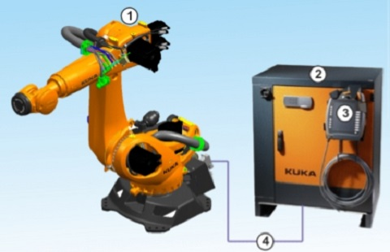
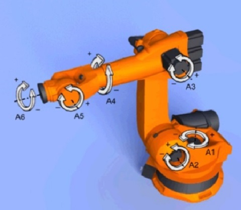
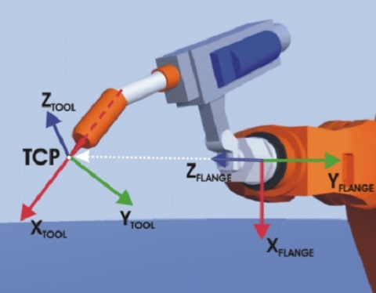

## KUKA 機器手臂與Leap Motion

### KUKA 機器手臂簡介
- KUKA [官網](https://www.kuka.com/) / [wiki](https://zh.wikipedia.org/wiki/%E5%BA%93%E5%8D%A1)

## 手臂基本介紹
### 六軸機器手臂

### 軸向
- A1~A6 

### 空間
- Base空間

- Tool空間

 

### 線上模擬環境
- 我們把模擬環境放在網站上了
- 網址在這邊  [RobotSim WebPlayer](http://www.wtech.com.tw/robotsim/demo)
- 在模擬器中我們可以學到這些
- 座標系
  - WORLD
  - BASE
  - TOOL  
- 操作方式
  - XYZ ABC
  - AXIS
- 運動指令
  - PTP
  - LIN
  - CIRC(網頁版的模擬器中沒有) 
- 軸極限  
  - A1~A6
- 手臂程式執行方式
  - 先教點
  - 用指令讓手臂重現動作

### Leap Motion簡介
  - 使用擷取手掌姿態的裝置
  - [Leap Motion Controller](https://www.ultraleap.com/product/leap-motion-controller/)
  
## Leap Motion與機器手臂互動介紹
#### Unity+leapmotion與機器手臂
<iframe width="560" height="315"
src="./demo.mp4" 
frameborder="0" 
allow="accelerometer; autoplay; encrypted-media; gyroscope; picture-in-picture" 
allowfullscreen></iframe>

-   [其他參考影片1](https://www.facebook.com/wisetech.dakuo/videos/1212236958861791/)
-   [其他參考影片2](https://www.facebook.com/wisetech.dakuo/videos/1225804447505042/)

#### 硬體
- Robot KR6 R700-2
- Leapmotion
- PC
- 使用 USB 連結 Leapmotion 與 PC
- 使用 網路線 連結 PC 與 機器手臂
#### 軟體
- EKI KUKA網路通訊介面
- Unity 遊戲引擎
- Leapmotion SDK
#### 通訊方式
- EKI XML 格式 
- 手臂端設定檔 [下載](./src/LeapMotion/LeepRobotServer.xml)
- 手臂端程式 [下載](./src/LeapMotion/LeapMotionRobot.zip)
- PC端程式 [下載](./src/LeapMotion/LeapMotionExample.zip)
## 互動體驗
- 通訊方式會影響手臂動作流暢度
- 使用EKI方式 [參考連結](http://forum.wtech.com.tw/viewtopic.php?f=2&t=38)
- 使用RSI方式 [參考連結](http://forum.wtech.com.tw/viewtopic.php?f=2&t=158)

<!--stackedit_data:
eyJoaXN0b3J5IjpbLTEyMDM3MjYwMTQsMTI4NDU3NjcyMiw2MD
AyNDU2MTYsLTE4NTY0MTk5MjMsMTIyNjg2Nzk5NiwtMTI4Mzk3
OTM4Myw0MzkwMzk2MjcsMjAzNzIzMjE3NiwtMTAzMDE2MzA4OC
wtMTkzNTI0NzQwNSw1MjU3NTE5MDEsLTE4OTQ2MDkyNTQsLTg2
MDU0MjM3NywtNDMyMDQyMDUxXX0=
-->